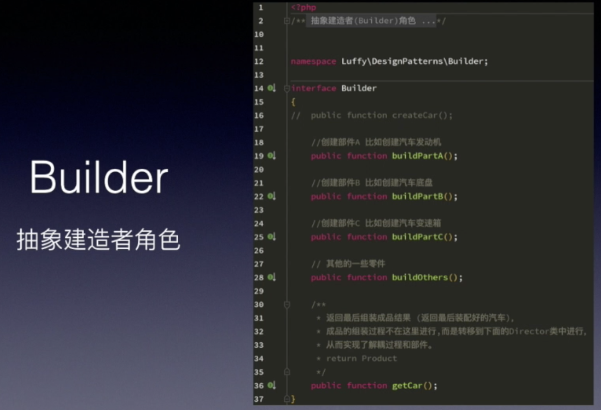
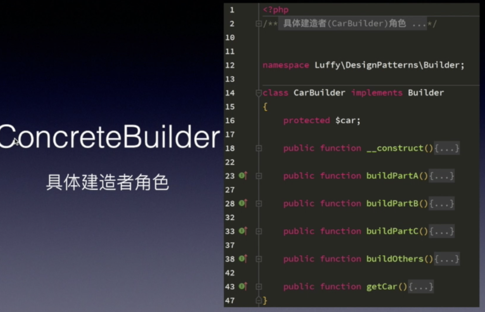
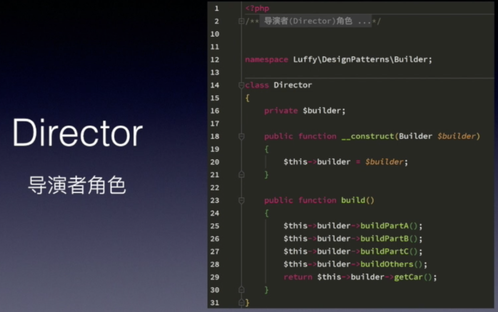
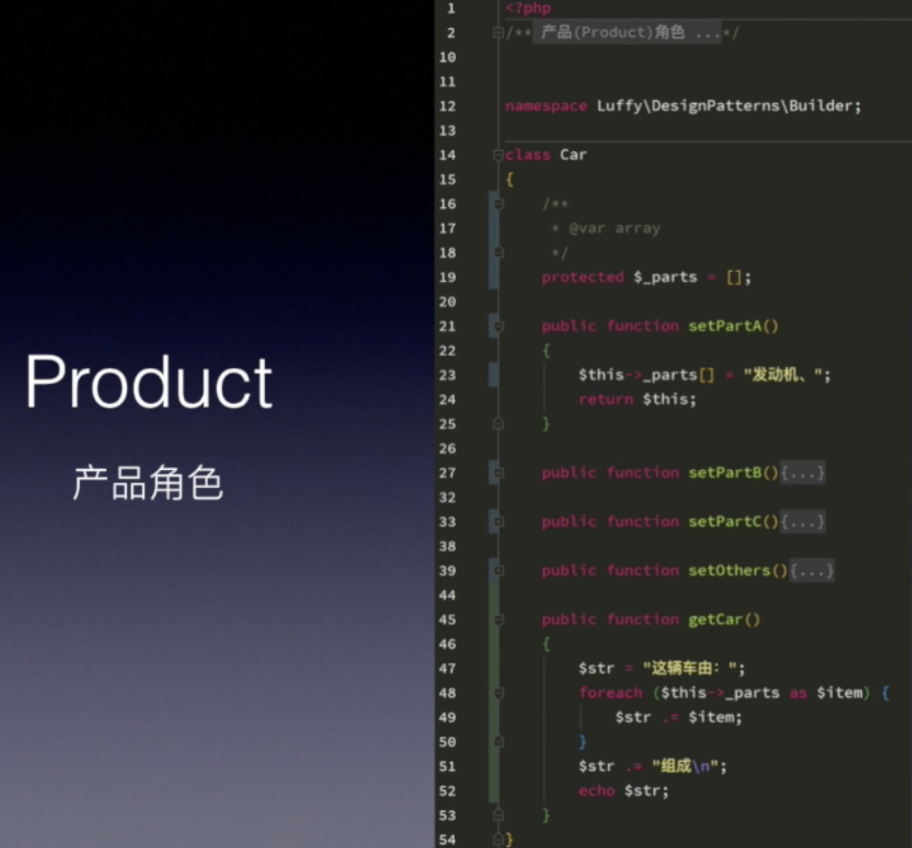

#### 建造者模式(生成器模式/建造模式)

对象构建模式, 将复杂对象的构建过程抽象出来, 使这个抽象的过程不同的一些实现方法可以构建不同的表现对象, 可以构建不同的属性对象.
	
代码示例:

	
	
总结: 优点是很好的将一个对象的实现跟相应的业务逻辑区分开, 在不改变事件逻辑的前提下增加改变实现变得很容易. 缺点是建造者接口的修改就会导致所有直线类的修改
	
应用场景: 
* 可能存在几种类型的对象
* 构造函数具有许多参数
