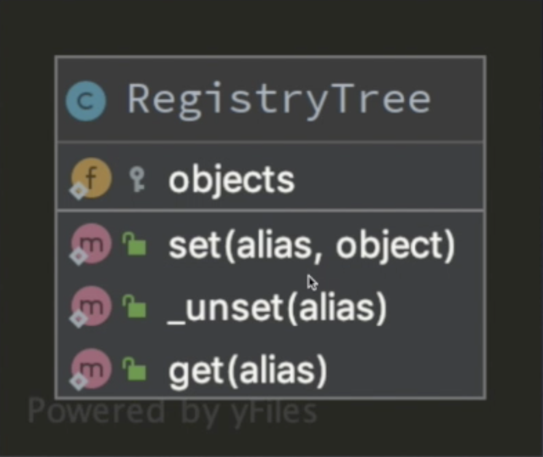

# 三大类型
	
* [创建型](./Creational)
* [结构型](./Structural)
* [行为型](./Behavioral)

#### 抽象工厂模式
工厂方法模式导致存在大量的工厂, 而抽象工厂模式就是提供了一个创建一系列相关或相互依赖的对象接口.抽象工厂和工厂方法最大的区别就是一个有一系列工厂,一个是只有一个.

应用场景: 不确定对应的实例化对象的时候, 创建对象类型和数目是未知的的时候

示例代码图:

	

优缺点:

* 产品和客户端完全分离
* 重复工作多
	
	
使用简单工厂来优化抽象工厂
利用反射来优化抽象工厂

总结: 简单工厂违法开闭原则, 对扩展的开放, 对修改的封闭. 工厂方法工厂类数目太多, 扩展性强一些. 抽象工厂支持增加产品总类, 抽象工厂增加新的产品组很方便

## 结构型
适配器、桥接、装饰器、组合、外观、享元、代理

#### 注册树模式(注册模式/注册器模式)
通过将对象的实例注册到全局的对象树上, 使用的时候从这个对象树上获取

代码结构: 四个一

应用场景: 单例模式解决了在项目中创建唯一对象的问题, 而工厂模式解决的是怎么通过 new 关键字去创建对象的方法, 而注册树就是来方便调用这些对象, 由单例和工厂模式等其他的方法实例化出来的对象, 注册树就是方便我们来调用的, 当我们需要使用对象的时候就可以从注册树上获取, 而不需要new了, 和使用全局变量一样方便
	
	
	
## 行为型
模块方法、命令、迭代器、观察者、中介者、备忘录、解释器、状态、策略、责任链、访问者