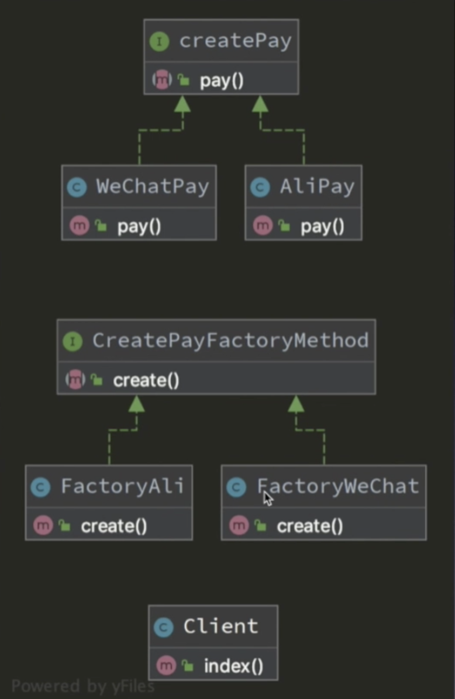

# 三大类型
	
* 创建型
* 结构型
* 行为型
	

## 创建型
* 工厂
* 抽象工厂
* 单例
* 建造者
* 原型

### 单例
单一的实例(mysqldb类),节省对象资源

1、防止用户通过new关键字无限实例化新对象
将构造函数私有化,就无法在类外面new一个新的对象

2、 增加一个静态的公共方法进入类的内部

3、 增加一个私有的静态属性

4、 将克隆魔术方法私有化

`总结: 单例模式的最经典做法,三私一公`

* 私有化构造方法: 防止使用 new 创建多个实例
* 公共的静态方法: 进入类的内部
* 私有化静态属性: 防止直接访问存储实例的属性
* 私有化克隆方法: 防止 clone 多个实例

5、将__wakeup方法私有化

`总结: 四私一公`
* 私有化构造方法: 防止使用 new 创建多个实例
* 公共的静态方法: 进入类的内部
* 私有化静态属性: 防止直接访问存储实例的属性
* 私有化克隆方法: 防止 clone 多个实例
* 私有化__wakeup方法: 防止反序列化

### 工厂模式
最常用的实例化对象的模式 用工厂方法代替 new 关键字来实例化对象操作的模式
返回的对象是没有关系的, 而单例模式始终返回的是同一个对象
好处: 比如更改实例化类名的时候, 只需要修改工厂方法里面的内容去实例化的这个类名, 
而不需要在你的代码中寻找具体实例化的地方再单独的进行修改. 提供灵活的动态扩展机制,减少我们代码的耦合性

PHP工厂模式
* 简单工厂模式
* 工厂方法模式
* 抽象工厂模式

#### 简单工厂模式(静态方法工厂模式)
通过静态方法创建对象, 提供了一个创建对象实例的功能, 而且不用担心具体的实现, 被创建的实例类型可以是接口抽象类, 也可以是具体的类

应用场景: 不确定有多少种操作的时候, 可以使用简单工厂模式.
比如: 运算操作, 加减乘除. 支付操作, 微信支付、支付宝支付、paypal、银联等
使用缓存存储的时候, mysql、redis、文件

示例: 

简单工厂模式图

简单说明接口类和抽象类, 接口类是定义一类的实体做什么, 比如支付类来实现支付. 抽象类是定义一类的实体是什么, 包含了属性、抽象的方法和非抽象的方法.

总结: 简单工厂的优缺点
* 帮助封装
* 解耦
* 违法了开放封闭原则

	
	
#### 工厂方法模式
定义了一个创建对象的接口, 它是让子类来决定让哪个类实例化, 解决了简单工行模式中的违法开放封闭原则

应用场景: 我们要实例的对象充满不确定性

示例结构图

	

#### 抽象工厂模式
工厂方法模式导致存在大量的工厂, 而抽象工厂模式就是提供了一个创建一系列相关或相互依赖的对象接口.抽象工厂和工厂方法最大的区别就是一个有一系列工厂,一个是只有一个.

应用场景: 不确定对应的实例化对象的时候, 创建对象类型和数目是未知的的时候

示例代码图:

	

优缺点:

* 产品和客户端完全分离
* 重复工作多
	
	
使用简单工厂来优化抽象工厂
利用反射来优化抽象工厂

总结: 简单工厂违法开闭原则, 对扩展的开放, 对修改的封闭. 工厂方法工厂类数目太多, 扩展性强一些. 抽象工厂支持增加产品总类, 抽象工厂增加新的产品组很方便

## 结构型
适配器、桥接、装饰器、组合、外观、享元、代理

#### 注册树模式(注册模式/注册器模式)
通过将对象的实例注册到全局的对象树上, 使用的时候从这个对象树上获取

代码结构: 四个一

应用场景: 单例模式解决了在项目中创建唯一对象的问题, 而工厂模式解决的是怎么通过 new 关键字去创建对象的方法, 而注册树就是来方便调用这些对象, 由单例和工厂模式等其他的方法实例化出来的对象, 注册树就是方便我们来调用的, 当我们需要使用对象的时候就可以从注册树上获取, 而不需要new了, 和使用全局变量一样方便
	
	
	
## 行为型
模块方法、命令、迭代器、观察者、中介者、备忘录、解释器、状态、策略、责任链、访问者