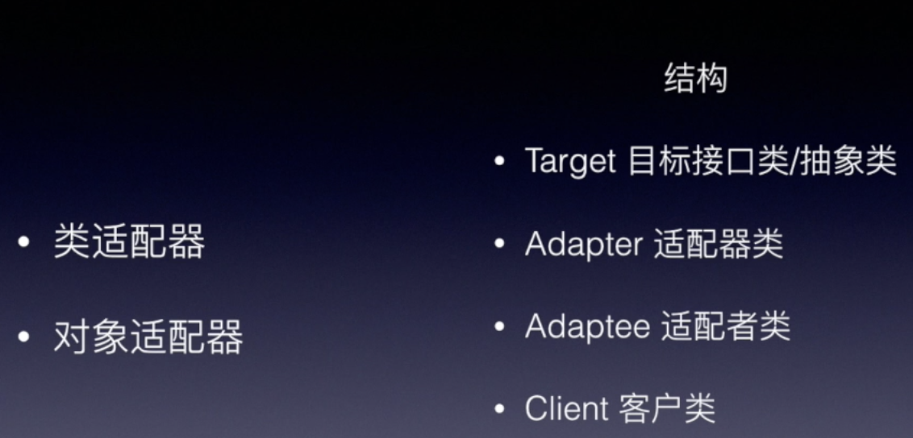
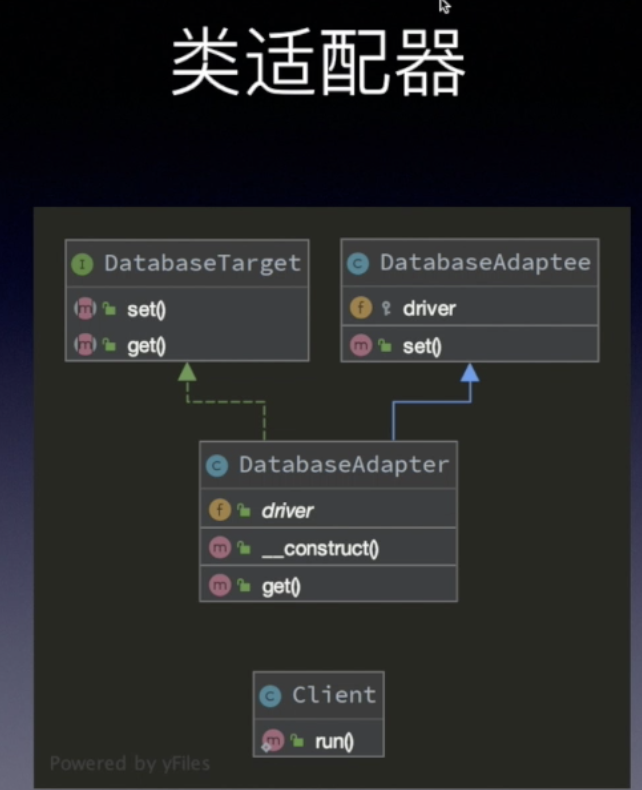
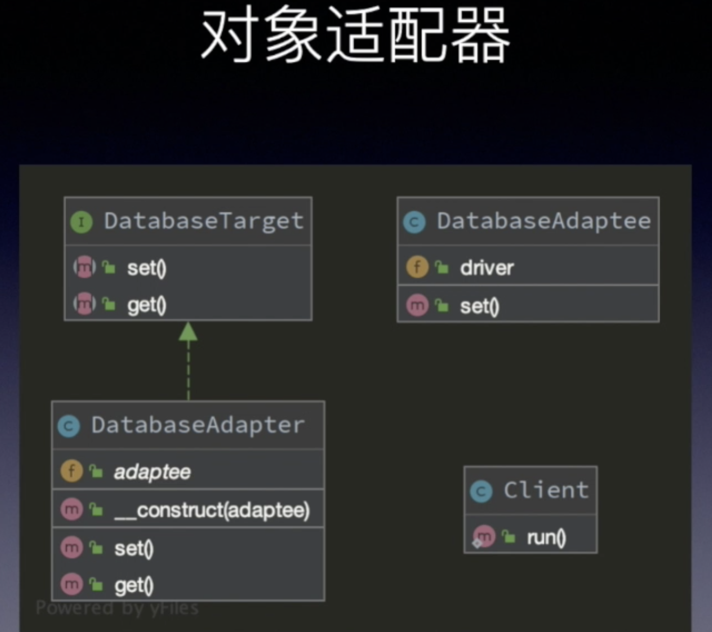

#### 适配器模式(包装器)
将类或者对象结合在一起形成复杂的、功能更为强大的结构, 使用适配器模式可以包装适配其他不兼容的对象, 让它和其它更多的类兼容, 使一些兼容的接口可以相互工作.

生活中的适配器:
* 中英文翻译
* 内存卡和读卡器
* 三孔插座和两孔插座

代码中的适配器:
* 实现interface
* 继承abstract

代码结构:

应用场景: 系统需要使用现有类, 但现有类接口不符合系统需要的时候, 可以使用类适配器. 想要建立一个重复使用的类, 用于一些彼此之间关联. 比如支付、数据库操作. 主要优点是将目标类和适配者类进行解耦, 增加类的复用性和扩展性. 对象适配器的耦合度比较低, 建议使用对象适配器